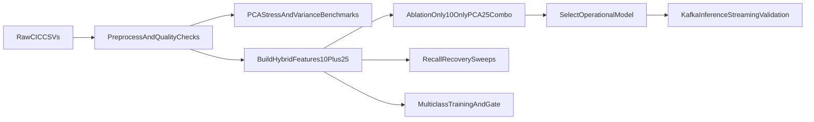

# NIDS Experiment Results Report

This report documents the experimental outcomes from the implemented pipeline, including model experiments, feature-space ablations, recall-recovery tests, multiclass comparison, and streaming inference performance.

---

## 1) Experiment Context

## Dataset and volume used

- Dataset family: CIC-IDS-2017 variant from Kaggle (`chethuhn/network-intrusion-dataset`)
- Total rows available for analysis: **2,830,743**
- Training rows used in main model experiments: **1,926,056**
- Validation rows used in main model experiments: **615,894**

## Current frozen model configuration

From `config/dynamic_params.json`:

- `pca_k`: **25**
- `pca_variance_retained`: **0.9671833184**
- `classification_threshold`: **0.05**
- `validation_f1_attack_binary`: **0.5351012288** (latest value reflects multiclass-derived binary mapping endpoint)

Primary selected operational model (based on ablation):
- **Binary XGBoost on hybrid feature set (10 targeted + 25 PCA)**

---

## 2) Experiment Pipeline Summary

---

## 3) PCA and Feature-Space Findings

Source: `logs/pca_full_comparison_20260428T180838Z.json`

| Preset | Rows | Total Time (s) | k95 | k99 | PC1 Var |
|---|---:|---:|---:|---:|---:|
| fast | 400,000 | 2.925 | 24 | 31 | 0.2169 |
| balanced | 1,200,000 | 11.148 | 25 | 33 | 0.2166 |
| full | 2,400,000 | 59.057 | 25 | 33 | 0.2165 |

Inference:
- PCA structure stabilized around **k95 ~= 25**, validating selection of `pca_k=25`.
- Balanced and full settings produced nearly identical PCA structure, indicating robust component behavior at scale.

---

## 4) Feature Ablation Results (Core Model Selection)

Source: `logs/xgb_feature_set_ablation_20260428T183205Z.json`

| Feature Set | Features | Threshold | Precision (Attack) | Recall (Attack) | F1 (Attack) |
|---|---:|---:|---:|---:|---:|
| only_targeted10 | 10 | 0.05 | 0.9579 | 0.4017 | 0.5660 |
| only_pca25 | 25 | 0.05 | 0.9633 | 0.2370 | 0.3804 |
| combo_targeted10_pca25 | 35 | 0.05 | **0.9949** | **0.4655** | **0.6343** |

Inference:
- **Combo 10+25** clearly outperformed both single-branch variants.
- PCA-only had strong precision but poor recall.
- Targeted-only was better than PCA-only on recall, but worse than combo.

---

## 5) Recall-Recovery Experiments

Source: `logs/recall_recovery_experiments_20260428T184030Z.json`

## 5.1 Threshold sweep on hybrid model

| Threshold | Precision | Recall | F1 |
|---:|---:|---:|---:|
| 0.30 | 0.9967 | 0.4177 | 0.5887 |
| 0.15 | 0.9962 | 0.4272 | 0.5980 |
| 0.10 | 0.9956 | 0.4380 | 0.6084 |
| 0.05 | **0.9949** | **0.4655** | **0.6343** |

Result:
- Lowering threshold improved recall and F1 while preserving high precision.

## 5.2 `scale_pos_weight` override sweep at threshold 0.05

| scale_pos_weight | Precision | Recall | F1 |
|---:|---:|---:|---:|
| 8.39 (base) | **0.9949** | **0.4655** | **0.6343** |
| 16.78 | 0.9945 | 0.4563 | 0.6255 |
| 50 | 0.9929 | 0.4172 | 0.5875 |
| 100 | 0.9931 | 0.4126 | 0.5830 |
| 200 | 0.9932 | 0.3818 | 0.5516 |

Result:
- Aggressive class-weight overrides degraded recall/F1 versus baseline.

## 5.3 No-PCA bypass check

At threshold 0.05 (raw 78 numeric features):
- Precision: 0.9651
- Recall: 0.3693
- F1: 0.5342

Result:
- No-PCA bypass underperformed hybrid 10+25 in recall/F1.

---

## 6) Multiclass vs Binary Outcome

Source: `logs/multiclass_vs_binary_20260428T190400Z.json`

| Metric | Binary Combo | Multiclass (mapped to attack-vs-benign) | Delta |
|---|---:|---:|---:|
| Precision (attack) | 0.9949 | 0.9898 | -0.0051 |
| Recall (attack) | 0.4655 | 0.3667 | -0.0989 |
| F1 (attack) | 0.6343 | 0.5351 | -0.0992 |

Recommendation recorded by pipeline:
- `keep_binary_plus_rules_fallback`

Important note:
- Multiclass validation showed unseen-class shift under strict day split; per-class gate failed accordingly.

---

## 7) Streaming Inference Performance (Operational)

Measured from bounded live runs:

- Run A: 3,000 events in 12.227s -> ~245 events/s average
- Run B: 1,500 events in 9.335s -> ~161 events/s average
- Run C: 2,000 events in 12.916s -> ~155 events/s average

Observed warm/steady logs reached:
- ~300+ events/s in active runs

Approximate per-event inference latency (pipeline-level, coarse estimate):
- At 245 events/s: ~4.1 ms/event
- At 161 events/s: ~6.2 ms/event
- At 155 events/s: ~6.4 ms/event

Dashboard throughput endpoint (`/metrics/throughput`) returns recent incidents/sec from persisted detections (not raw Kafka message rate), so it is expected to be lower when threat rate is low.

---

## 8) Current Final Dashboard Metrics

From live `/metrics/final`:

- Precision (attack): **0.9948701569**
- Recall (attack): **0.4655461348**
- F1 (attack): **0.6342820999**
- Threshold: **0.05**
- PCA k: **25**
- PCA variance retained: **0.9671833184**

Target checks currently encoded in dashboard:

- Precision target (>= 0.85): **PASS**
- Recall target (>= 0.80): **FAIL**
- F1 target (>= 0.60): **PASS**

---

## 9) Operational Validation Results

Validated successfully:

- Kafka producer -> Kafka topic
- Consumer inference -> threat filtering
- MongoDB incident writes
- Campaign aggregation upserts
- FastAPI endpoints
- Live dashboard rendering with charts and tables

Additional implemented fix:
- Dataset variant lacked IP columns; producer now emits deterministic simulation IPs when absent, so incident/campaign views no longer remain `unknown`.

---

## 10) Key Conclusions

1. The chosen hybrid feature strategy (**10 targeted + PCA25**) is empirically the strongest among tested options.
2. Threshold tuning is the most effective lever among tested post-training controls.
3. Over-aggressive class weighting did not improve recall in this setup.
4. Pure no-PCA approach was inferior to the hybrid branch.
5. Multiclass objective under current split regime underperformed binary detection due to class/day shift.
6. The streaming system is operational and stable with real-time detection, persistence, aggregation, API, and dashboard.

---

## 11) Remaining Optimization Opportunities

- Introduce grouped temporal stratification (`Label x Day`) for multiclass fairness
- Add explicit unknown-attack policy for unseen classes in multiclass mode
- Perform per-class threshold/risk policy for binary-to-rule classification bridge
- Add load tests under higher producer rates and report end-to-end p95 latency
- Add automated regression benchmark harness for model + streaming metrics

---

## 12) Evidence Files

- `logs/pca_full_comparison_20260428T180838Z.json`
- `logs/xgb_feature_set_ablation_20260428T183205Z.json`
- `logs/recall_recovery_experiments_20260428T184030Z.json`
- `logs/multiclass_vs_binary_20260428T190400Z.json`
- `logs/multiclass_eval_20260428T190400Z.json`
- `config/dynamic_params.json`

---

## 13) Benchmark Evidence (Operational SLO Track)

New benchmark pipeline outputs:
- `logs/benchmark_baseline_<timestamp>.json`
- `logs/benchmark_baseline_<timestamp>.md`
- `logs/benchmark_full_plan_<timestamp>.json`
- `logs/benchmark_full_plan_<timestamp>.md`
- `logs/benchmark_runtime_metrics.json` (consumer runtime snapshot)

API visibility:
- `GET /metrics/benchmark`
- `GET /metrics/slo`

SLO status semantics:
- `PASS`: measured and meets target
- `FAIL`: measured and below target
- `UNVERIFIED`: insufficient measurements yet

