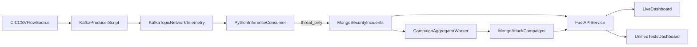
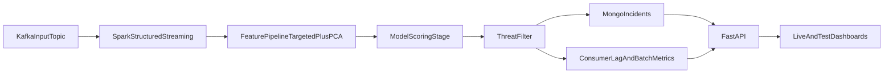

# FastAPI and Spark-ML Architecture Guide

This document explains, in practical terms, how the NIDS serving layer is designed and how the Spark-ML path is intended versus what is currently running in this repository.

It is written from the actual code and runtime behavior.

---

## 1) Executive Overview

Your system has two architecture layers:

- **Operational (currently implemented):**
  - Kafka producer publishes flow events
  - Python consumer runs XGBoost inference
  - Threat-only events are written to MongoDB
  - Campaign aggregator builds grouped attack campaigns
  - FastAPI serves query/metrics endpoints and dashboards

- **Planned/Target (Spark-ML oriented):**
  - Spark Structured Streaming handles controlled micro-batches
  - Spark performs transform + model scoring + stateful aggregation
  - FastAPI remains read/query and visualization layer

Today, the first path is the active one in code.

---

## 2) End-to-End Data Flow (Current)

---

## 3) FastAPI Design (How it is built)

Primary file: `scripts/api_server.py`

### 3.1 App initialization

- Loads env vars and builds a `FastAPI` app.
- Creates a shared Mongo client and two collections:
  - incidents collection (threat events)
  - campaigns collection (aggregated attacker windows)
- Uses a project root path (`ROOT`) to read JSON artifacts from `logs/`.

### 3.2 Design pattern used across endpoints

- **Query endpoints** read Mongo collections and return clean JSON.
- **Metrics endpoints** combine:
  - Mongo aggregate queries
  - latest offline experiment artifacts from `logs/*.json`
  - runtime benchmark snapshots
- **Dashboard endpoints** return HTML with embedded JavaScript that calls JSON endpoints.
- Most endpoints fail gracefully (returning empty/default payloads instead of crashing).

### 3.3 Endpoint groups

- **Health**
  - `/health`
  - checks Mongo ping

- **Incident/Campaign query**
  - `/incidents/recent`
  - `/campaigns/recent`
  - `/campaigns/{attacker_ip}`

- **Live operational metrics**
  - `/metrics/summary`
  - `/metrics/timeseries`
  - `/metrics/throughput`
  - `/metrics/hotspots`
  - `/metrics/model_eval`
  - `/metrics/final`

- **Benchmark/SLO metrics**
  - `/metrics/benchmark`
  - `/metrics/slo`
  - `/metrics/consumer_lag`
  - `/metrics/test_catalog`

- **Dashboard pages**
  - `/dashboard` (live ops dashboard)
  - `/dashboard/tests` (single-page consolidated test dashboard)

### 3.4 Why this FastAPI design works well

- Separates data collection (consumer/aggregator) from presentation (API/dashboard).
- Keeps model-training artifacts queryable at runtime through `logs/`.
- Supports both operational monitoring and experiment reporting from one service.
- Enables clear SLO status with `PASS/FAIL/UNVERIFIED`.

---

## 4) Streaming Inference Design (Current Python path)

### 4.1 Producer design

File: `scripts/stream_kafka_producer.py`

- Reads source CSV rows and sends each as a Kafka message.
- Adds:
  - normalized/synthetic `source_ip` and `destination_ip`
  - `ingest_ts` timestamp (for latency measurement)
  - optional benchmark tags (`benchmark_run_id`, `benchmark_profile`)

### 4.2 Consumer design

File: `scripts/stream_kafka_inference_consumer.py`

- Consumes from Kafka topic.
- Builds feature vector for targeted feature set.
- Runs `predict_proba` via loaded XGBoost model.
- If score >= threshold:
  - writes incident event to Mongo
  - stores latency markers:
    - ingest -> detect
    - detect -> write
    - ingest -> write
- Every 1000 messages:
  - writes runtime benchmark snapshot to `logs/benchmark_runtime_metrics.json`
  - appends consumer lag trend point to `logs/consumer_lag_history.jsonl`

### 4.3 Campaign aggregation design

File: `scripts/stream_campaign_aggregator.py`

- Polls incidents in lookback windows.
- Buckets by source IP and time window.
- Upserts campaign docs with confidence and dominant threat type.
- This is a practical local CEP worker (not Spark state-store CEP).

---

## 5) Spark-ML Design: Intended vs Current

### 5.1 Intended Spark-ML pipeline (from your design direction)

Planned pipeline:

1. Read Kafka stream in micro-batches
2. Parse and type-cast features
3. Feature pipeline:
   - targeted features preserved
   - scaled/vectorized branch for broad numeric features
   - PCA reduction
4. Model scoring
5. Threat filtering
6. Sink writes and stateful aggregation

Configuration hints already present in repo:

- `config/settings.yaml`
  - `max_offsets_per_trigger`
  - `trigger_interval_seconds`
  - checkpoint path scaffold
- `requirements.txt` includes `pyspark`

### 5.2 What is currently implemented

- There is an active Spark Structured Streaming inference job: `scripts/spark_kafka_inference_consumer.py`.
- The Spark job uses the **hybrid best model** (`models/xgb_combo_targeted10_pca25.joblib`) and reproduces PCA features via the hybrid preprocessing artifacts produced by `make build-hybrid`.
- CEP aggregation/campaign formation remains the Python worker (`scripts/stream_campaign_aggregator.py`), and FastAPI reads from MongoDB.

### 5.3 Why this is still valid engineering

- Local Python path is faster to iterate/debug for architecture and model policy validation.
- Benchmark/SLO instrumentation is already in place and reusable.
- Moving to Spark later becomes an execution-engine migration, not a system redesign.

---

## 6) FastAPI + Spark Integration Blueprint (Next implementation stage)

If you decide to activate Spark runtime:

Recommended split:

- Spark does compute + stream processing.
- FastAPI remains query/metrics/UI service.
- Keep SLO and test-catalog endpoints unchanged so dashboards continue working.

---

## 7) Industry Metrics Mapping (What you now track)

Already tracked or exposed:

- Throughput (`processed_rate_eps`, persisted incident rate)
- End-to-end latency p95 (ingest -> write)
- Split latency:
  - ingest -> detect p95
  - detect -> write p95
- Consumer lag trend (message backlog)
- Mongo write errors
- SLO status summary

Still recommended for stricter enterprise grade:

- p99 split latencies surfaced in API
- explicit Kafka partition lag by partition
- API p95 response time endpoint
- sustained soak run auto-report generation
- alert thresholds and anomaly flags

---

## 8) Practical Interpretation of Your Current Results

From measured runs:

- `detect -> write` is very low (DB write path is not bottleneck).
- `ingest -> detect` is very high under load (backlog/processing lag dominates).
- This means optimization priority is:
  1) consumer processing capacity
  2) message backlog control
  3) only then storage tuning

---

## 9) File Map (Where each responsibility lives)

- API and dashboards: `scripts/api_server.py`
- Kafka producer: `scripts/stream_kafka_producer.py`
- Inference consumer + benchmark snapshot + lag trend: `scripts/stream_kafka_inference_consumer.py`
- Campaign aggregation worker: `scripts/stream_campaign_aggregator.py`
- Runtime/benchmark outputs: `logs/`
- Streaming/Spark-oriented config scaffold: `config/settings.yaml`

---

## 10) Final Summary

Your FastAPI is designed as a **query + metrics + dashboard control plane** on top of Mongo and run artifacts.

Your Spark-ML architecture is **well-defined in intent**, but the current executable path is Python consumer-based inference. This is acceptable for local validation and has already produced useful SLO/lag evidence.

You now have a strong foundation to either:

- continue improving the Python runtime path for local/demo reliability, or
- migrate compute stages to Spark while preserving the same FastAPI contract and dashboard layer.
