# NIDS Implementation Execution Report

This document captures what was actually implemented in this workspace, what was tested, the current operational state, and what remains.  
It is an execution and delivery report, not a re-statement of the original design specification.

---

## 1) Scope Delivered

The delivered system covers:

- Data bootstrap from Kaggle and preprocessing automation
- Pilot and large-scale data analysis workflows
- Feature-space experiments (targeted only, PCA only, hybrid)
- Binary and multiclass model training/evaluation scripts
- Streaming pipeline (Kafka producer + live inference consumer)
- Incident persistence to MongoDB
- Campaign aggregation layer (windowed aggregation job)
- FastAPI query and monitoring API
- Live dashboard with metrics and visualizations

---

## 2) Codebase Artifacts by Capability

## 2.1 Environment and Project Setup

- `requirements.txt`  
- `.env.example`  
- `scripts/setup_mac.sh`  
- `scripts/check_environment.py`  
- `Makefile`  
- `README_SETUP.md`

What this provides:
- reproducible local setup
- dependency bootstrap
- health checks
- make targets for repeatable execution

## 2.2 Data Acquisition and Preprocessing

- `scripts/bootstrap_dataset.py`
- `scripts/phase1_prepare_pilot.py`
- `scripts/data_analysis_preprocess_xgb.py`
- `config/feature_contract.yaml`
- `config/settings.yaml`
- `config/dynamic_params.json`

What this provides:
- automatic CIC dataset fetch and sync to `data/raw`
- pilot generation and quality logging
- XGBoost-oriented preprocessing
- dynamic parameter persistence

## 2.3 Analysis and Diagnostics

- `scripts/pca_interactive_analysis.py`
- `scripts/pca_full_comparison.py`
- `scripts/eda_attack_drift_analysis.py`
- `scripts/recall_recovery_experiments.py`

What this provides:
- interactive PCA report
- scale feasibility benchmark for local Mac
- attack drift and correlation diagnostics
- recall recovery experiments (threshold, class-weight sweep, no-PCA checks)

## 2.4 Feature Engineering and Model Training

- `scripts/build_hybrid_feature_space.py`
- `scripts/train_hybrid_xgb_stage.py`
- `scripts/train_feature_set_ablation.py`
- `scripts/train_multiclass_hybrid_xgb.py`

What this provides:
- hybrid feature space creation (10 targeted + PCA-25)
- binary model training/evaluation
- ablation experiments (only-10 vs only-PCA25 vs combo)
- multiclass training with per-class gate + comparison output

## 2.5 Streaming and Serving Layer

- `scripts/stream_kafka_producer.py`
- `scripts/stream_kafka_inference_consumer.py`
- `scripts/stream_campaign_aggregator.py`
- `scripts/api_server.py`

What this provides:
- traffic event production to Kafka
- real-time inference and threat filtering
- incident writes to Mongo
- campaign upserts
- API and dashboard endpoints

---

## 3) Runtime Architecture (As Implemented)

```mermaid
flowchart LR
  csvData[CICCSVSource] --> producer[KafkaProducerScript]
  producer --> kafkaTopic[KafkaTopicNetworkTelemetry]
  kafkaTopic --> consumer[InferenceConsumerScript]
  consumer --> threatFilter[ThresholdFilter]
  threatFilter --> incidents[MongoSecurityIncidents]
  incidents --> aggregator[CampaignAggregatorScript]
  aggregator --> campaigns[MongoAttackCampaigns]
  incidents --> api[FastAPIService]
  campaigns --> api
  api --> dashboard[LiveDashboard]
```

---

## 4) Model and Feature Decisions (Actual)

Final operational feature strategy:

- Targeted raw features: **10**
- PCA components: **25**
- Combined model feature count: **35**

Dynamic parameter snapshot (current):

- `pca_k`: `25`
- `pca_variance_retained`: `0.9671833184071473`
- `classification_threshold`: `0.05`
- `validation_f1_attack_binary`: `0.5351012287578243`

Current final dashboard model metrics:

- Precision (attack): `0.9948701568957674`
- Recall (attack): `0.4655461347537004`
- F1 (attack): `0.6342820999367489`

---

## 5) Key Experimental Results

## 5.1 PCA Feasibility on Local Mac

Large-row PCA tests completed successfully and demonstrated that analysis is feasible locally at large scale.

Observed in run outputs:
- 400k rows: a few seconds
- 1.2M rows: ~11 seconds class
- 2.4M rows: ~59 seconds class

Artifacts:
- `logs/mac_pca_stress_test.json`
- `logs/mac_pca_stress_test_large.json`
- `logs/pca_full_comparison_*.json`
- `logs/pca_full_comparison_*.html`

## 5.2 Feature-Set Ablation (Critical)

Three training modes were compared:

1. only targeted 10
2. only PCA 25
3. targeted 10 + PCA 25

Result:
- combo `10+25` produced the best attack F1 among tested sets.

Artifact:
- `logs/xgb_feature_set_ablation_*.json`

## 5.3 Recall-Recovery Tests

Tested:
- threshold sweeps (`0.30`, `0.15`, `0.10`, `0.05`)
- `scale_pos_weight` overrides
- no-PCA bypass

Result:
- Lower threshold improved recall
- Extreme class-weight overrides degraded performance
- No-PCA bypass did not outperform hybrid

Artifact:
- `logs/recall_recovery_experiments_*.json`

## 5.4 Multiclass Evaluation Insight

Multiclass run exposed validation class-coverage issues under strict day split:
- Friday holdout contained classes absent in Mon–Thu training
- Per-class gate failed (as expected signal)

Artifacts:
- `logs/multiclass_eval_*.json`
- `logs/multiclass_vs_binary_*.json`

---

## 6) Streaming Pipeline Execution Status

Current status:

- Kafka stream producer works
- Inference consumer processes events and flags threats
- Mongo persistence works when Mongo is up
- Campaign aggregator runs and writes campaign documents
- API endpoints and dashboard are live

Notable production-hardening behavior implemented:

- API endpoints fail gracefully when Mongo is unavailable
- Aggregator has bounded-cycle mode for controlled tests (`CAMPAIGN_MAX_CYCLES`)

---

## 7) Dashboard Capabilities (Current)

Dashboard endpoint:
- `GET /dashboard`

Metrics endpoints:
- `GET /health`
- `GET /incidents/recent`
- `GET /campaigns/recent`
- `GET /campaigns/{attacker_ip}`
- `GET /metrics/summary`
- `GET /metrics/timeseries`
- `GET /metrics/hotspots`
- `GET /metrics/final`
- `GET /metrics/throughput`
- `GET /metrics/model_eval`

Visualization content delivered:

- incident and campaign KPIs
- model final metrics (precision/recall/F1/threshold)
- target pass/fail status badges
- incident trend and confidence trend
- top IP share and hotspots (ports/types)
- confusion matrix panel
- throughput card
- incident and campaign detail tables

---

## 8) Runbook (Current Working Commands)

Prerequisites:
- Kafka running
- MongoDB running
- Python venv and dependencies installed

Recommended start sequence:

1. `make stream-consumer`
2. `make campaign-aggregator`
3. `make api`
4. `make stream-producer`

Useful helper:
- `make run-stack` (prints startup order)

---

## 9) Data/ID Handling Notes

- Training-time feature guardrails now explicitly exclude identifier fields such as `Source IP`, `Destination IP`, `Flow ID`, `Timestamp` in preprocessing/feature scripts.
- Streaming payloads now normalize IP keys.
- For dataset variants that do not include source/destination IP columns, deterministic synthetic IPs are generated in producer for simulation visibility.

---

## 10) What Is Completed vs Pending

## Completed

- Automated data bootstrap and preprocessing
- PCA and feature-space analysis pipeline
- Hybrid feature generation (10+25)
- Binary and multiclass training scripts
- Ablation and recall-recovery diagnostics
- Real-time stream inference pipeline
- Mongo persistence + campaign aggregation
- API + upgraded live dashboard

## Remaining / Recommended Next Work

- Introduce grouped temporal stratification split (`Label x Day`) for multiclass fairness
- Add explicit unknown-attack routing policy for unseen-class scenarios
- Add authentication and role controls for API endpoints
- Add structured test suite and CI job for scripts/endpoints
- Add deployment packaging (Docker compose or service units)
- Add observability: persistent structured logs + alerting thresholds

---

## 11) Evidence Artifacts

Key output folders/files:

- `logs/*.json` (evaluation, ablations, drift, stress tests, streaming checks)
- `logs/*.html` (PCA and comparison dashboards)
- `models/*.joblib` (trained model artifacts)
- `data/processed/*.pkl` (prepared feature datasets)

These represent the reproducible execution record of what was actually run and achieved.

